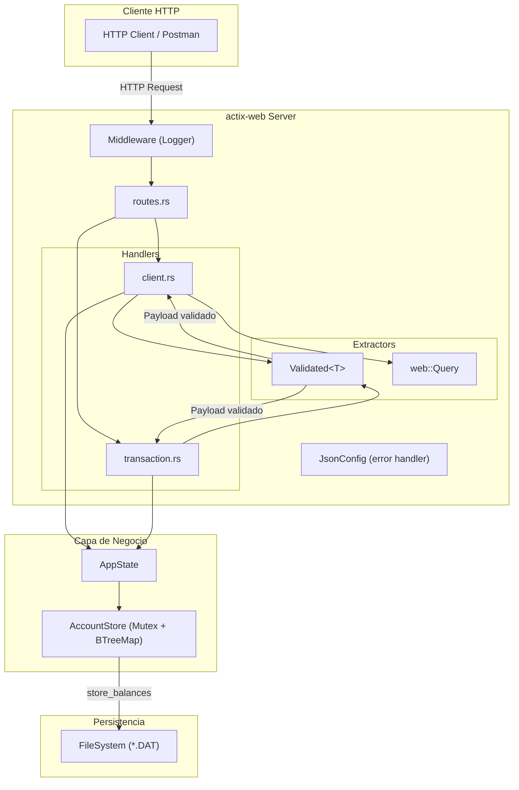
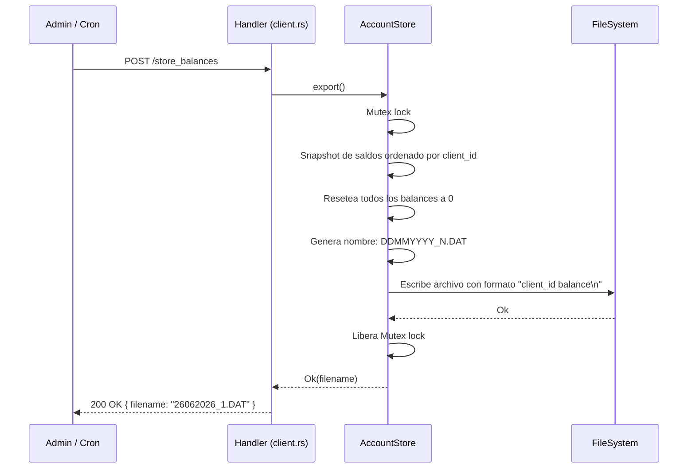
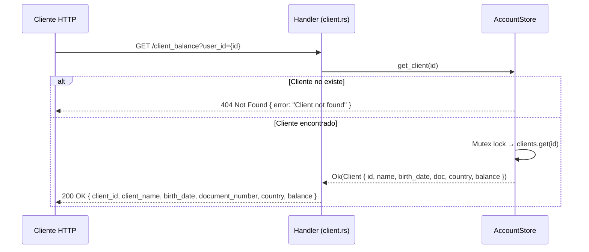

# Challenge Prex

API RESTful construida en **Rust** con [actix-web](https://actix.rs/) para la gestión de clientes de una plataforma financiera. Permite crear clientes, consultar saldos, realizar transacciones de crédito/débito y exportar saldos diarios a disco.

---

## Tabla de Contenidos

- [Quick Start (Docker)](#quick-start-docker)
- [Quick Start (Local)](#quick-start-local)
- [Estructura del Proyecto](#estructura-del-proyecto)
- [Arquitectura y Flujo](#arquitectura-y-flujo)
- [Decisiones de Diseño](#decisiones-de-diseño)
- [Endpoints (Referencia de API)](#endpoints-referencia-de-api)
- [Pruebas](#pruebas)
- [Stack Tecnológico](#stack-tecnológico)

---

## Quick Start (Docker)

La forma más rápida de levantar el proyecto. Solo necesitas tener [Docker](https://docs.docker.com/get-docker/) instalado.

```bash
# 1. Clonar el repositorio
git clone <repo-url> && cd challenge-prex

# 2. Construir la imagen (multi-stage build, ~5 min la primera vez)
docker build -t challenge-prex .

# 3. Levantar el contenedor
docker run -d -p 8080:8080 --name challenge-prex-api challenge-prex

# 4. Verificar que la API responde
curl -s http://localhost:8080/client_balance?user_id=1
```

**Comandos útiles:**

```bash
# Ver logs en tiempo real
docker logs -f challenge-prex-api

# Detener el contenedor
docker stop challenge-prex-api

# Eliminar el contenedor
docker rm challenge-prex-api
```

> **Nota sobre el Dockerfile:** Se utiliza un *multi-stage build* con caché de dependencias.
> En la etapa `builder`, primero se copian solo `Cargo.toml` y `Cargo.lock` y se compilan las dependencias con un `main.rs` vacío. Esto permite que Docker cachee la capa de dependencias y solo recompile el código fuente en builds posteriores. La imagen final usa `debian:bookworm-slim` para mantener un tamaño mínimo.

---

## Quick Start (Local)

Requisitos: [Rust toolchain](https://rustup.rs/) (edición 2024).

```bash
# Compilar y ejecutar
cargo run

# La API estará disponible en http://127.0.0.1:8080
```

---

## Estructura del Proyecto

```
challenge-prex/
├── Cargo.toml                          # Dependencias y metadatos del proyecto
├── Dockerfile                          # Build multi-stage optimizado
├── challenge_prex_postman_collection.json  # Colección Postman para pruebas manuales
│
├── src/
│   ├── main.rs                         # Punto de entrada: configura servidor, middleware y estado
│   ├── lib.rs                          # Raíz del crate library (re-exporta módulos públicos)
│   ├── state.rs                        # AppState: estado compartido de la aplicación
│   ├── store/                          # Capa de almacenamiento y lógica de negocio
│   │   ├── mod.rs                      # Re-exporta componentes principales
│   │   ├── account_store.rs            # AccountStore y ClientsState (CRUD, exportación)
│   │   └── store_error.rs              # StoreError: manejo de errores del dominio
│   │
│   └── api/
│       ├── mod.rs                      # Re-exporta sub-módulos de la API
│       ├── routes.rs                   # Configuración centralizada de rutas
│       ├── error.rs                    # ApiError: manejo estructurado de errores (JSON)
│       ├── validated.rs                # Extractor Validated<T>: validación automática de payloads
│       │
│       ├── handlers/                   # Controladores HTTP (un archivo por dominio)
│       │   ├── client.rs              #   → new_client, client_balance, store_balances
│       │   └── transaction.rs         #   → new_credit_transaction, new_debit_transaction
│       │
│       └── models/                     # DTOs de request/response (un archivo por dominio)
│           ├── client.rs              #   → NewClientRequest/Response, ClientBalanceRequest/Response, etc.
│           └── transaction.rs         #   → NewCreditTransactionRequest/Response, NewDebitTransactionRequest/Response
│
└── tests/
    ├── e2e.rs                          # Tests End-to-End (integración completa)
    └── README.md                       # Documentación detallada de los tests
```

### Capas de la Arquitectura

| Capa | Archivos | Responsabilidad |
|------|----------|-----------------|
| **Entrypoint** | `main.rs` | Configura el `HttpServer`, inyecta el estado global y registra rutas/middleware |
| **Routing** | `routes.rs` | Registro centralizado de todos los endpoints en un único `ServiceConfig` |
| **Handlers** | `handlers/*.rs` | Orquestación HTTP: recibe requests, delega al store, devuelve responses |
| **Models** | `models/*.rs` | DTOs de serialización/deserialización con validación incorporada (`Validate` trait) |
| **Validación** | `validated.rs` | Extractor genérico `Validated<T>` que valida automáticamente antes de llegar al handler |
| **Errores** | `error.rs` | Tipo `ApiError` que implementa `ResponseError` para respuestas de error consistentes |
| **Store** | `store/*.rs` | Lógica de negocio: CRUD de clientes, créditos, débitos y exportación a disco (`AccountStore::export`) |
| **State** | `state.rs` | Wrapper del estado compartido (`AppState`) inyectado vía `web::Data` |

---

## Arquitectura y Flujo

### Diagrama de Componentes



### Flujo de Creación de Cliente

```mermaid
sequenceDiagram
    participant C as Cliente HTTP
    participant V as "Validated&lt;T&gt;"
    participant H as Handler (client.rs)
    participant S as AccountStore

    C->>H: POST /new_client { client_name, birth_date, document_number, country }
    H->>V: Deserializa y valida payload
    
    alt Validación falla
        V-->>C: 400 Bad Request { error: "..." }
    end

    V->>H: NewClientRequest validado
    H->>S: create_client(name, birth_date, doc, country)
    
    alt document_number ya existe
        S-->>C: 409 Conflict { error: "Client already exists" }
    else Nuevo cliente
        S->>S: next_id += 1 → genera ID único
        S->>S: Inserta en BTreeMap de clientes y HashMap de documentos
        S-->>H: Ok(client_id)
        H-->>C: 200 OK { client_id }
    end
```

### Flujo de Transacción (Crédito)

```mermaid
sequenceDiagram
    participant C as Cliente HTTP
    participant V as "Validated&lt;T&gt;"
    participant H as Handler (transaction.rs)
    participant S as AccountStore

    C->>H: POST /new_credit_transaction { client_id, credit_amount }
    H->>V: Deserializa y valida (id > 0, amount > 0)
    V->>H: NewCreditTransactionRequest validado
    H->>S: credit(client_id, amount)

    alt Cliente no existe
        S-->>C: 404 Not Found { error: "Client not found" }
    else Cliente existe
        S->>S: Mutex lock → clients.get_mut(client_id)
        S->>S: balance += amount
        S-->>H: Ok(new_balance)
        H-->>C: 200 OK { client_id, new_balance }
    end
```

### Flujo de Transacción (Débito)

```mermaid
sequenceDiagram
    participant C as Cliente HTTP
    participant V as "Validated&lt;T&gt;"
    participant H as Handler (transaction.rs)
    participant S as AccountStore

    C->>H: POST /new_debit_transaction { client_id, debit_amount }
    H->>V: Deserializa y valida (id > 0, amount > 0)
    V->>H: NewDebitTransactionRequest validado
    H->>S: debit(client_id, amount)

    alt Cliente no existe
        S-->>C: 404 Not Found { error: "Client not found" }
    else Saldo insuficiente
        S-->>C: 400 Bad Request { error: "Insufficient funds" }
    else Débito exitoso
        S->>S: Mutex lock → clients.get_mut(client_id)
        S->>S: balance -= amount
        S-->>H: Ok(new_balance)
        H-->>C: 200 OK { client_id, new_balance }
    end
```

### Flujo de Cierre de Día (Store Balances)



### Flujo de Consulta de Balance



---

## Decisiones de Diseño

### 1. Almacenamiento en memoria

Se eligió un store completamente en memoria por las restricciones del challenge.
Todo el estado mutable de los clientes se protege con un único `Mutex<ClientsState>`:

- **Por qué `Mutex<BTreeMap>`:** La carga esperada es baja y el modelo de concurrencia es simple. El uso de `BTreeMap` permite que los clientes se mantengan ordenados por ID automáticamente, simplificando la exportación.
- **Consistencia en exportación:** El `Mutex` se mantiene durante todo el ciclo de `export()` — snapshot, reset de balances y escritura a disco — garantizando que ninguna transacción concurrente pueda observar un estado parcialmente reseteado ni escribir en el archivo al mismo tiempo.
- **Índice secundario bajo el mismo lock:** El `document_index: HashMap<String, u64>` vive dentro del mismo `ClientsState` protegido por el `Mutex`, por lo que la verificación de unicidad de documento y la inserción del cliente son atómicas sin ningún mecanismo adicional.

### 2. Generación de IDs simple y segura

Los IDs de cliente y el contador de archivos se manejan con simples contadores `u64` dentro del estado central (`ClientsState`).

- **Sin variables atómicas:** Dado que todas las operaciones adquieren el `Mutex` para asegurar la consistencia general del sistema, los contadores pueden incrementarse bajo el mismo lock con total seguridad, evitando la sobrecarga mental y el uso innecesario de `AtomicU64`.

### 3. Extractor genérico `Validated<T>` para validación

En lugar de validar manualmente en cada handler, se implementó un extractor de actix-web personalizado:

- **Composición declarativa:** El handler solo declara `Validated<NewClientRequest>` en su firma y recibe un payload ya validado.
- **Trait `Validate`:** Cada modelo implementa sus propias reglas con `anyhow::ensure!`, manteniendo la lógica de validación co-ubicada con la definición del DTO.
- **Reutilizable:** Cualquier nuevo endpoint solo necesita implementar `Validate` en su request model.

### 4. `ApiError` con `thiserror` para errores consistentes

Todos los errores de la API siguen un formato JSON uniforme `{ "error": { "message": "..." } }`:

- **Sin duplicación de status:** El código HTTP ya viaja en la capa de transporte; repetirlo en el cuerpo es redundante. `ApiError` almacena un `StatusCode` de actix-web directamente.
- **`ResponseError` trait:** Permite que actix-web convierta errores automáticamente en respuestas HTTP con el status code correcto.
- **Separación de responsabilidades:** La capa del store lanza un tipo `StoreError` agnóstico a la API, y los handlers HTTP (`api/error.rs` vía `From`) lo convierten en el `ApiError` correspondiente (ej: `409 Conflict`, `404 Not Found`).

### 5. Aritmética precisa con `rust_decimal`

Los montos financieros se representan con `rust_decimal::Decimal` en lugar de `f64`:

- **Sin errores de punto flotante:** `0.1 + 0.2 == 0.3` siempre es verdadero con `Decimal`.
- **Serialización nativa:** Con el feature `serde`, se serializa/deserializa como string JSON, evitando pérdida de precisión en el transporte.

### 6. Multi-stage Docker build con caché de dependencias

El `Dockerfile` separa la compilación de dependencias del código fuente:

- **Primera etapa:** Compila dependencias con un `main.rs` vacío → capa cacheada por Docker.
- **Segunda etapa:** Solo recompila el código fuente del proyecto → builds incrementales rápidos (~10s vs ~5min).
- **Imagen final:** Basada en `debian:bookworm-slim` → imagen de producción liviana sin toolchain de Rust.

### 7. Separación `lib.rs` / `main.rs`

El proyecto expone los módulos como crate library (`lib.rs`) además del binario (`main.rs`):

- **Testabilidad:** Los tests E2E en `tests/e2e.rs` importan directamente las estructuras del crate (`use challenge_prex::...`) sin necesidad de levantar un servidor HTTP real.
- **Reutilización:** Permite que otros crates o herramientas consuman la lógica de negocio.

---

## Endpoints (Referencia de API)

Base URL: `http://localhost:8080`

### `POST /new_client`

Crea un nuevo cliente en el sistema.

**Request Body:**
```json
{
  "client_name": "Juan Perez",
  "birth_date": "1990-01-01",
  "document_number": "12345678",
  "country": "AR"
}
```

**Validaciones:**
| Campo | Regla |
|-------|-------|
| `client_name` | No puede estar vacío (ni solo espacios) |
| `birth_date` | Debe ser una fecha pasada (formato `YYYY-MM-DD`) |
| `document_number` | No puede estar vacío |
| `country` | Código ISO de 2 letras exactas |

**Respuestas:**
| Status | Body |
|--------|------|
| `200` | `{ "client_id": 1 }` |
| `400` | `{ "error": { "message": "..." } }` |
| `409` | `{ "error": { "message": "Client already exists" } }` |

---

### `GET /client_balance?user_id={id}`

Consulta los datos y balance de un cliente.

**Respuestas:**
| Status | Body |
|--------|------|
| `200` | `{ "client_id": 1, "client_name": "Juan Perez", "birth_date": "1990-01-01", "document_number": "12345678", "country": "AR", "balance": "150.50" }` |
| `404` | `{ "error": { "message": "Client not found" } }` |

---

### `POST /new_credit_transaction`

Añade fondos al balance de un cliente.

**Request Body:**
```json
{
  "client_id": 1,
  "credit_amount": "150.50"
}
```

**Validaciones:** `client_id > 0`, `credit_amount > 0`.

**Respuestas:**
| Status | Body |
|--------|------|
| `200` | `{ "client_id": 1, "new_balance": "150.50" }` |
| `400` | `{ "error": { "message": "Credit amount must be greater than zero" } }` |
| `404` | `{ "error": { "message": "Client not found" } }` |

---

### `POST /new_debit_transaction`

Resta fondos del balance de un cliente.

**Request Body:**
```json
{
  "client_id": 1,
  "debit_amount": "50.00"
}
```

**Validaciones:** `client_id > 0`, `debit_amount > 0`, saldo suficiente.

**Respuestas:**
| Status | Body |
|--------|------|
| `200` | `{ "client_id": 1, "new_balance": "100.50" }` |
| `400` | `{ "error": { "message": "Insufficient funds" } }` (validación o saldo insuficiente) |
| `404` | `{ "error": { "message": "Client not found" } }` |

---

### `POST /store_balances`

Exporta los saldos actuales a un archivo en disco y resetea todos los balances a `0`.

El directorio de salida de los archivos `.DAT` se configura mediante la variable de entorno `EXPORT_DIR`.
Si no se define, los archivos se escriben en el directorio de trabajo actual.

```bash
EXPORT_DIR=/var/data/exports cargo run
```

**Respuestas:**
| Status | Body |
|--------|------|
| `200` | `{ "filename": "26062026_1.DAT" }` |
| `500` | `{ "error": { "message": "..." } }` (error de escritura en disco) |

**Formato del archivo generado:**
```
1 150.50
2 0
3 75.25
```

---

## Pruebas

### Tests Unitarios

Los modelos de request incluyen tests unitarios que validan exhaustivamente las reglas de validación:

```bash
cargo test
```

**Cobertura de validaciones testeadas:**

| Modelo | Tests |
|--------|-------|
| `NewClientRequest` | Nombre vacío, fecha futura, fecha de hoy, documento vacío, código de país inválido |
| `NewCreditTransactionRequest` | Client ID = 0, monto = 0 |
| `NewDebitTransactionRequest` | Client ID = 0, monto = 0 |

### Tests End-to-End

Ubicados en `tests/e2e.rs`, validan flujos completos utilizando el `TestServer` de actix-web (sin necesidad de levantar un servidor HTTP real):

| Test | Flujo validado |
|------|----------------|
| `test_create_account_and_fetch_balance` | Crear cliente → consultar balance (= 0) → crédito → verificar balance → débito → verificar balance |
| `test_store_balances_resets_balance` | Crear cliente → crédito → store_balances → verificar archivo DAT → verificar balance reseteado a 0 |
| `test_duplicate_document_number_rejected` | Crear cliente → intentar crear otro con mismo documento → verificar 409 Conflict |

Para más detalles sobre los tests, consultar [`tests/README.md`](tests/README.md).

### Colección Postman

Se incluye `challenge_prex_postman_collection.json` para pruebas manuales interactivas:

1. Importar el archivo en [Postman](https://www.postman.com/) o compatible (Insomnia, Bruno, etc.)
2. Levantar la API (`cargo run` o Docker)
3. Ejecutar las peticiones preconfiguradas

---

## Stack Tecnológico

| Dependencia | Versión | Propósito |
|-------------|---------|-----------|
| [actix-web](https://crates.io/crates/actix-web) | 4 | Framework web async de alto rendimiento |
| [serde](https://crates.io/crates/serde) / [serde_json](https://crates.io/crates/serde_json) | 1.0 | Serialización/deserialización JSON |
| [rust_decimal](https://crates.io/crates/rust_decimal) | 1.42 | Aritmética decimal de precisión arbitraria |
| [chrono](https://crates.io/crates/chrono) | 0.4 | Manejo de fechas y timestamps |
| [thiserror](https://crates.io/crates/thiserror) | 2.0 | Derivación ergonómica de tipos de error |
| [anyhow](https://crates.io/crates/anyhow) | 1.0 | Manejo flexible de errores con contexto |
| [env_logger](https://crates.io/crates/env_logger) / [log](https://crates.io/crates/log) | 0.11 / 0.4 | Logging configurable vía `RUST_LOG` |
