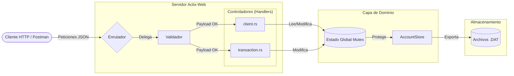
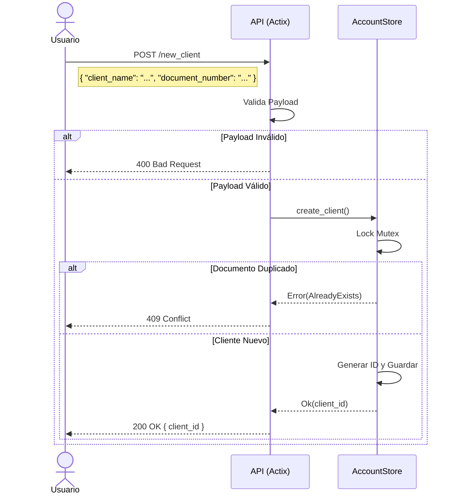
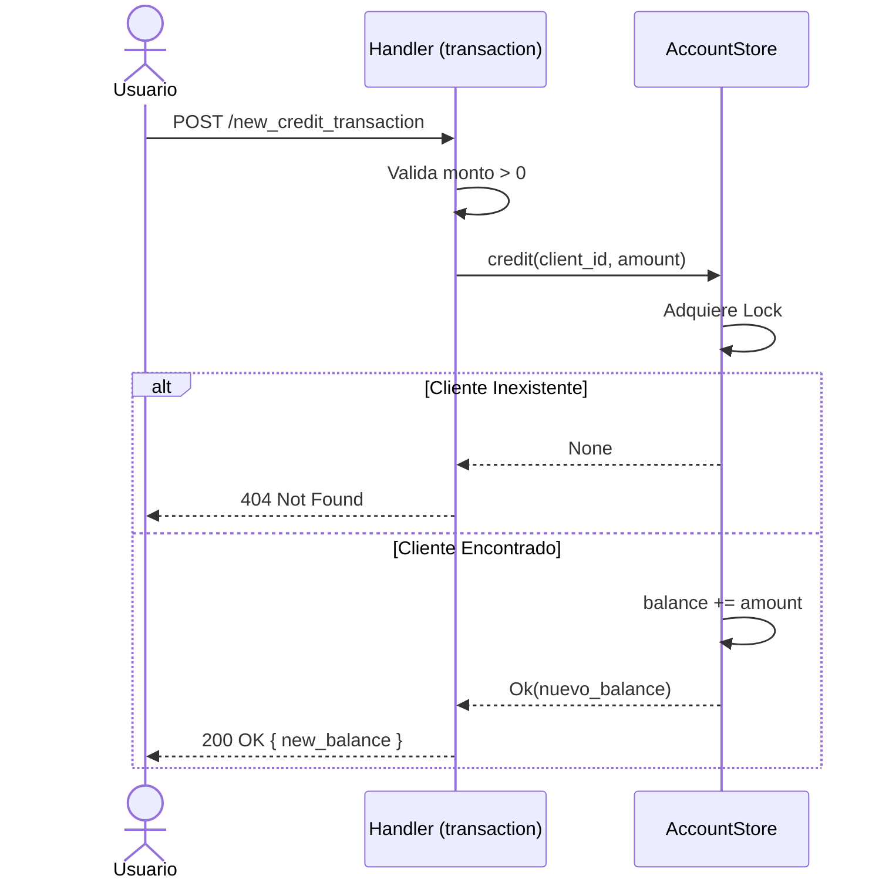
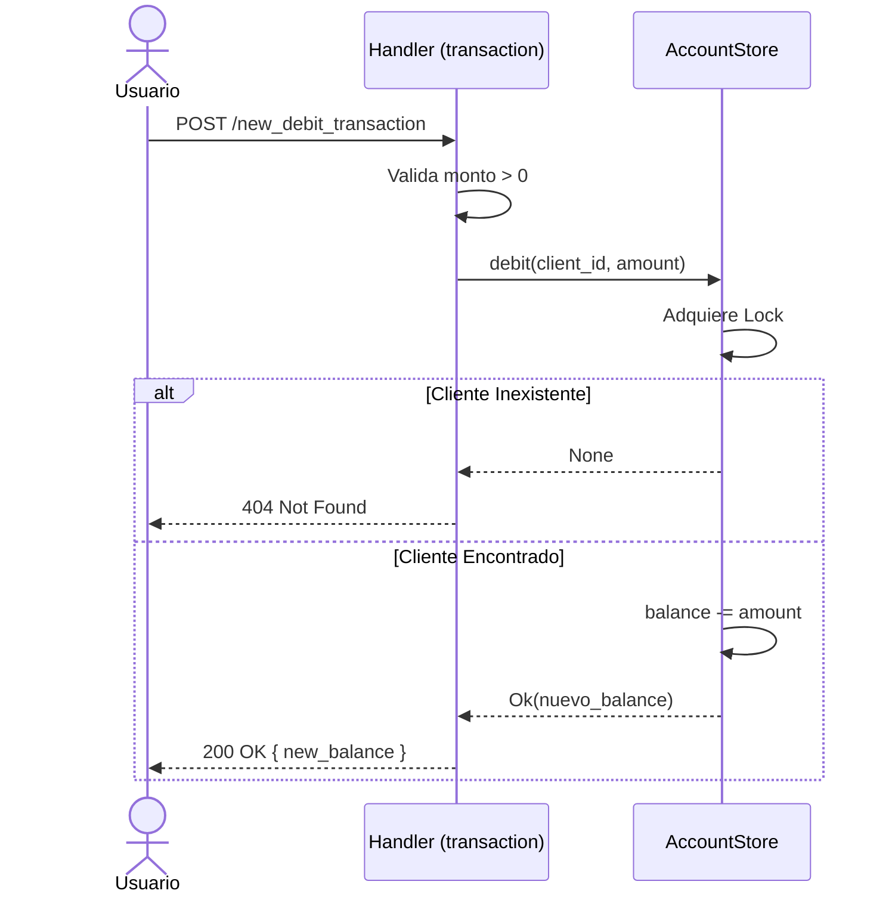
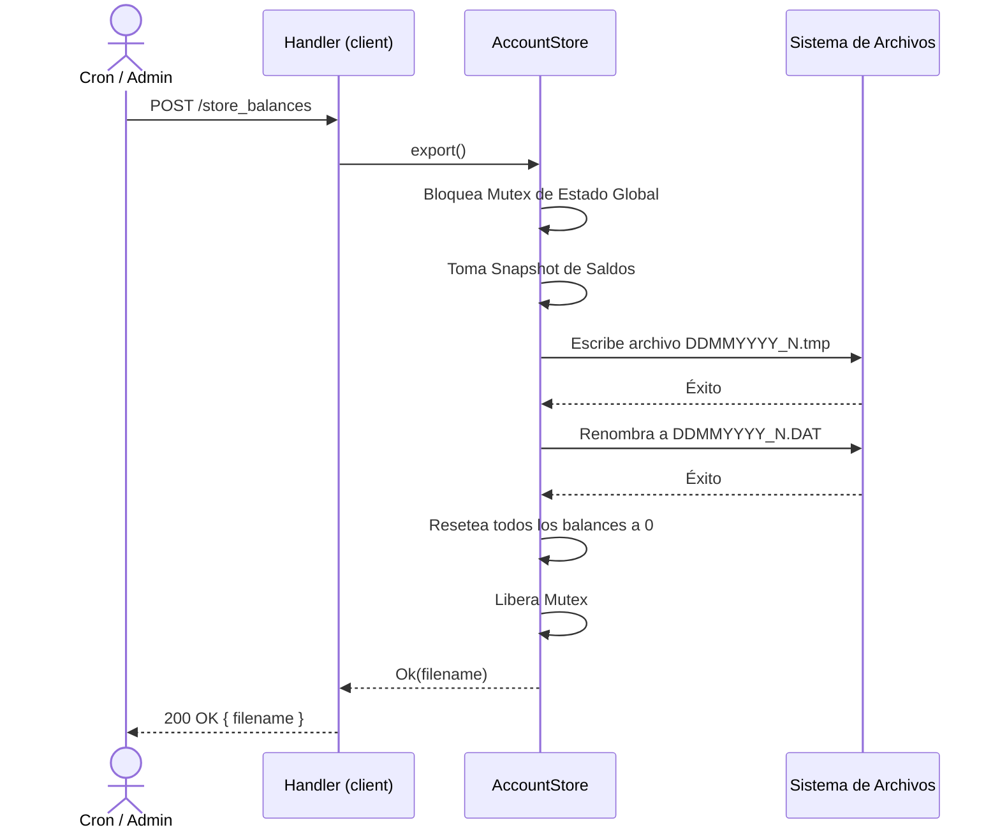
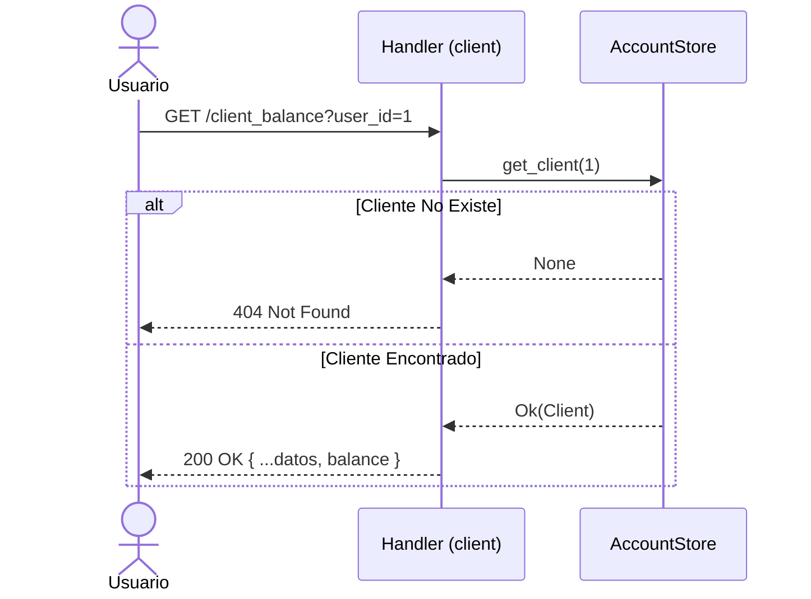

# Challenge Prex


## Quick Start (Docker)

La forma más rápida de levantar el proyecto es utilizando Docker Compose.

```bash
# Clonar el repositorio
git clone https://github.com/fkrause98/prex-challenge/blob/main/README.md && cd challenge-prex

# Levantar el proyecto usando Docker Compose
docker-compose up --build -d

```
---

## Quick Start (Local)

Alternativamente, con Rust 1.96:
```bash
cargo run
```


## Secciones 

| Capa | Archivos | Responsabilidad |
|------|----------|-----------------|
| **Entrypoint** | `main.rs` | Configura el `HttpServer`, inyecta el estado global y registra rutas/middleware |
| **Routing** | `routes.rs` | Registro centralizado de todos los endpoints en un único `ServiceConfig` |
| **Handlers** | `handlers/*.rs` | Orquestación HTTP: recibe requests, delega al store, devuelve responses |
| **Models** | `models/*.rs` | DTOs de serialización/deserialización con validación incorporada (`Validate` trait) |
| **Validación** | `validated.rs` | Extractor genérico `Validated<T>` que valida automáticamente antes de llegar al handler |
| **Errores** | `error.rs` | Tipo `ApiError` que implementa `ResponseError` para respuestas de error consistentes |
| **Store** | `store/*.rs` | Lógica de negocio: CRUD de clientes, créditos, débitos y exportación a disco (`AccountStore::export`) |
| **State** | `state.rs` | Wrapper del estado compartido (`AppState`) inyectado vía `web::Data` |

---

## Arquitectura y Flujo

### Diagrama de Componentes



### Flujo de Creación de Cliente



### Flujo de Transacción (Crédito)



### Flujo de Transacción (Débito)



### Flujo de Store Balances



### Flujo de Consulta de Balance



---

## Decisiones

### Almacenamiento en memoria

Se eligió un store completamente en memoria por las restricciones del challenge.
Todo el estado mutable de los clientes se protege con un único `Mutex<ClientsState>`:

- Se guardan los datos bajo un`BTreeMap`, permite que los clientes se mantengan ordenados por ID automáticamente, simplificando la escritura a disco.
- Un `Mutex` se mantiene durante todo el ciclo de `export()` garantizando que ninguna transacción concurrente pueda observar un estado parcialmente reseteado. El resto de operaciones deben tomar este mismo mutex para manipular el estado de los clientes. Se podría ser más granular en base
a los requisitos de consistencia y rendimiento que existieran.

### Generación de IDs

Los IDs de cliente y el contador de archivos se manejan con simples contadores `u64` dentro del estado central (`ClientsState`).

### Extractor genérico `Validated<T>` para validación

En lugar de validar manualmente en cada handler, implementé un
extractor custom de Actix, basta con que la entidad
que representa una request implemente un simple trait.


### Errores

Todos los errores de la API siguen un formato JSON uniforme `{ "error": { "message": "..." } }`:


### Aritmética `rust_decimal`

Los montos financieros se representan con `rust_decimal::Decimal` en lugar de `f64`, tal y como se pide en el challenge. Además este crate soporta serde.

---

## Endpoints (Referencia de API)

Base URL: `http://localhost:8080`

### `POST /new_client`

Crea un nuevo cliente en el sistema.

**Request Body:**
```json
{
  "client_name": "Juan Perez",
  "birth_date": "1990-01-01",
  "document_number": "12345678",
  "country": "AR"
}
```

**Validaciones:**
| Campo | Regla |
|-------|-------|
| `client_name` | No puede estar vacío (ni solo espacios) |
| `birth_date` | Debe ser una fecha pasada (formato `YYYY-MM-DD`) |
| `document_number` | No puede estar vacío |
| `country` | Código ISO de 2 letras exactas |

**Respuestas:**
| Status | Body |
|--------|------|
| `200` | `{ "client_id": 1 }` |
| `400` | `{ "error": { "message": "..." } }` |
| `409` | `{ "error": { "message": "Client already exists" } }` |

---

### `GET /client_balance?user_id={id}`

Consulta los datos y balance de un cliente.

**Respuestas:**
| Status | Body |
|--------|------|
| `200` | `{ "client_id": 1, "client_name": "Juan Perez", "birth_date": "1990-01-01", "document_number": "12345678", "country": "AR", "balance": "150.50" }` |
| `404` | `{ "error": { "message": "Client not found" } }` |

---

### `POST /new_credit_transaction`

Añade fondos al balance de un cliente.

**Request Body:**
```json
{
  "client_id": 1,
  "credit_amount": "150.50"
}
```

**Validaciones:** `client_id > 0`, `credit_amount > 0`.

**Respuestas:**
| Status | Body |
|--------|------|
| `200` | `{ "client_id": 1, "new_balance": "150.50" }` |
| `400` | `{ "error": { "message": "Credit amount must be greater than zero" } }` |
| `404` | `{ "error": { "message": "Client not found" } }` |

---

### `POST /new_debit_transaction`

Resta fondos del balance de un cliente.

**Request Body:**
```json
{
  "client_id": 1,
  "debit_amount": "50.00"
}
```

**Validaciones:** `client_id > 0`, `debit_amount > 0`.

**Respuestas:**
| Status | Body |
|--------|------|
| `200` | `{ "client_id": 1, "new_balance": "100.50" }` |
| `404` | `{ "error": { "message": "Client not found" } }` |

---

### `POST /store_balances`

Exporta los saldos actuales a un archivo en disco y resetea todos los balances a `0`.

El directorio de salida de los archivos `.DAT` se configura mediante la variable de entorno `EXPORT_DIR`.
Si no se define, los archivos se escriben en el directorio de trabajo actual.

```bash
EXPORT_DIR=/var/data/exports cargo run
```

**Respuestas:**
| Status | Body |
|--------|------|
| `200` | `{ "filename": "26062026_1.DAT" }` |
| `500` | `{ "error": { "message": "..." } }` (error de escritura en disco) |

**Formato del archivo generado:**
```
1 150.50
2 0
3 75.25
```

---

## Tests

### End-to-End

Se encuentra en en `tests/e2e.rs`, validan flujos completos utilizando el `TestServer` de actix-web:

| Test | Flujo validado |
|------|----------------|
| `test_create_account_and_fetch_balance` | Crear cliente → consultar balance (= 0) → crédito → verificar balance → débito → verificar balance |
| `test_store_balances_resets_balance` | Crear cliente → crédito → store_balances → verificar archivo DAT → verificar balance reseteado a 0 |
| `test_duplicate_document_number_rejected` | Crear cliente → intentar crear otro con mismo documento → verificar 409 Conflict |


### Colección Postman

Se incluye `challenge_prex_postman_collection.json` para pruebas manuales interactivas:

1. Importar el archivo en [Postman](https://www.postman.com/).
2. Levantar la API (`cargo run` o Docker).

